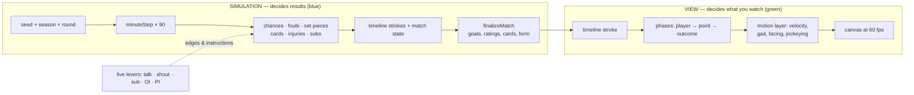
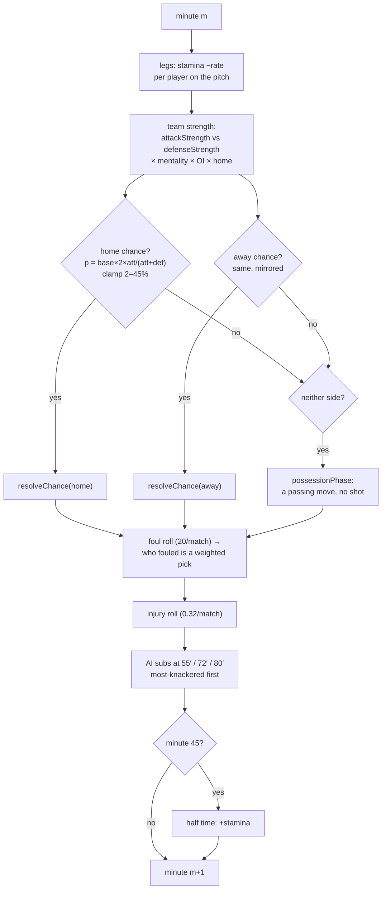
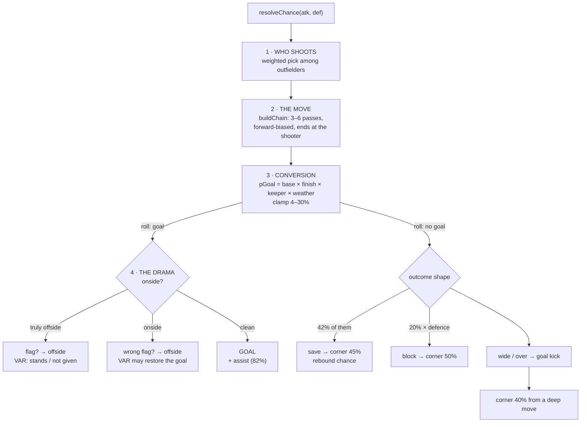
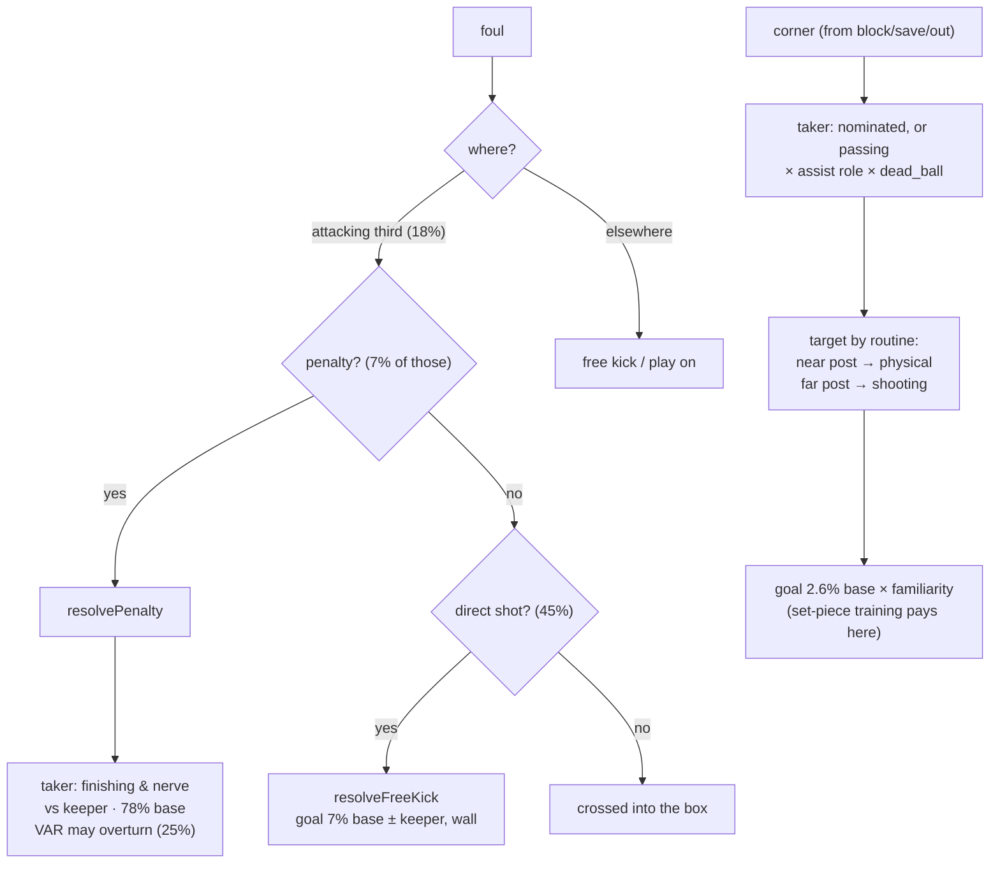
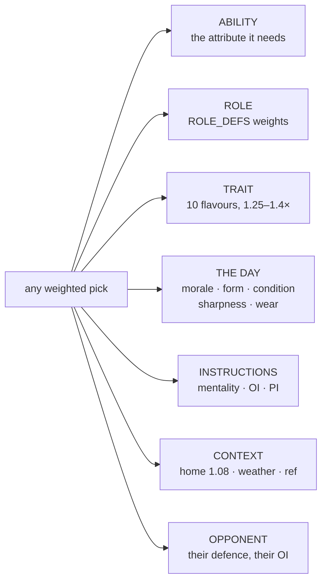
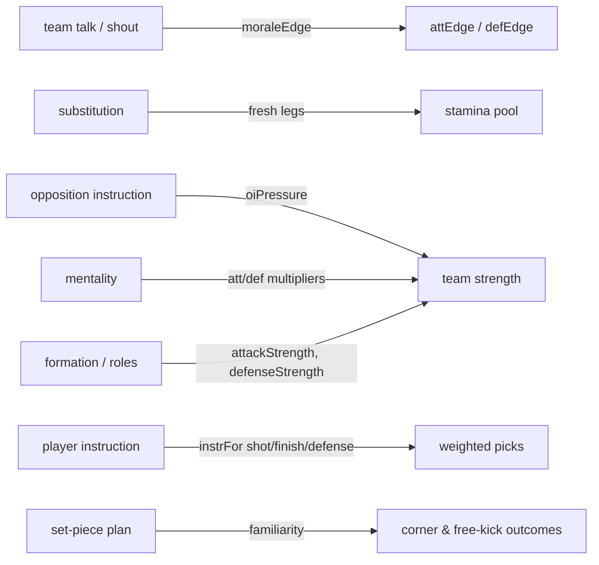
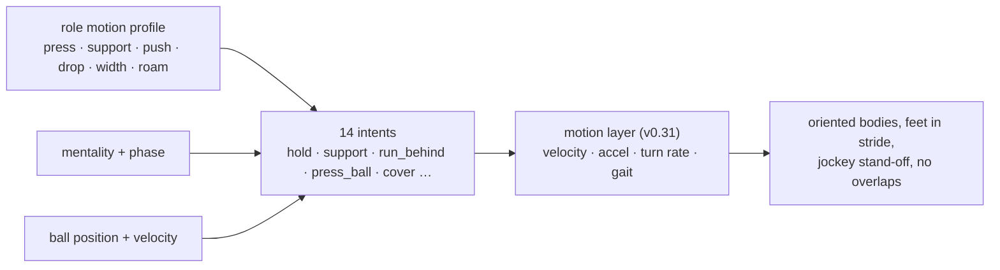

# The match engine, as pictures

*Read this with `docs/engine-map.html` open in a browser (click any box for the formula it hides). Everything here is drawn straight from the code — file and line references included.*

Two rules to hold in your head:

- **Blue = the simulation.** It decides results. Deterministic: same seed, same season, byte for byte.
- **Green = the view.** It decides what you *see* — movement, intents, facing. It never writes back.



## 1 · The minute loop

Every minute re-rolls the match from scratch. There is no memory of "momentum" — only state (score, stamina, cards, instructions).



## 2 · Inside a chance — where individuals actually decide

This is the only place in the sim where a *named player* makes a *choice*: who shoots, who assists, and what happens.



**What each pick multiplies** (the shot weight, `match.ts:532`):

```text
weight(shooter) =
    position         FW 4.0   ·  MF 2.4  ·  DF 0.7
  × (0.5 + shooting/100)
  × role.shot        a Poacher shoots; an Anchor doesn't
  × trait            shoots_on_sight ×1.25
  × attEdge          morale · form · sharpness · wear · challenge bonus
  × instruction      your "shoot more" PI
```

## 3 · Set pieces and penalties — their own decision nodes



## 4 · The bias stack — what every weight is made of

Nothing is a coin flip on its own. Each pick multiplies a stack; remove any layer and the number changes.



## 5 · Where your live levers land



## 6 · The formula card

| # | What | Formula | Where |
|---|---|---|---|
| 1 | Chance per minute, per side | `clamp(0.108 × 2 × att/(att+def), 0.02, 0.45)` | `match.ts:1340` |
| 2 | Team attack | `attackStrength(XI, roles, mentality) × homeAdvantage × oiPressure` | `match.ts:1337` |
| 3 | Shot weight | see §2 — position × shooting × role × trait × edge × PI | `match.ts:544` |
| 4 | Conversion | `0.115 × (1+(finish−60)/120) × (1+(60−keeper)/160) × weather` → clamp 4–30% | `match.ts:562` |
| 5 | Per-player edge | `moraleEdge × staminaFactor × sharpness × wear × form × challenge` | `match.ts:72` |
| 6 | Fouls per match | `20/90` per minute × `conditionEffects.fouls` | `match.ts:1361` |
| 7 | Card share of fouls | `0.18 × weather × fouling tactics` → ≈ 3.6 cards/match | `match.ts:1364` |
| 8 | Stamina drain | `staminaDrainPerMinute(player)` — pace and physical set the rate | `match.ts:1318` |
| 9 | Corner → goal | `0.026 × familiarityFactor(routine)` | `match.ts:1130` |
| 10 | Penalty | `0.78 ± finishing vs keeper`, VAR review 12% → overturn 25% | `match.ts:864` |

## 7 · The view layer (green) — decisions with no consequences



## 8 · Code map

| File | What lives there |
|---|---|
| `src/engine/match.ts` | the whole sim: minute loop, chances, fouls, set pieces, shootouts |
| `src/engine/tuning.ts` | every constant in one table (`T`) |
| `src/engine/ratings.ts` | attack/defence strength, role scoring (`ROLE_DEFS`) |
| `src/engine/live.ts` | the manager's in-match levers, journaled as changes |
| `src/engine/intents.ts` | the 14 off-ball intents (view only) |
| `src/ui/motion.ts` | body physics for the picture (view only) |
| `src/ui/screens/MatchScreen.tsx` | the 60 fps loop: strokes → phases → canvas |

---

*Prefer to click instead of read? Open **`docs/engine-map.html`** — same content as an interactive map, no build step, works offline.*
